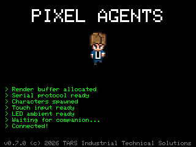
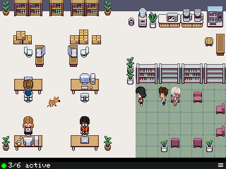
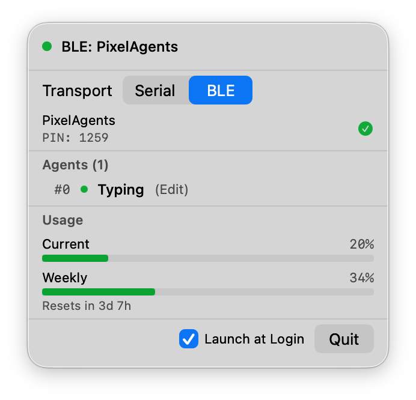
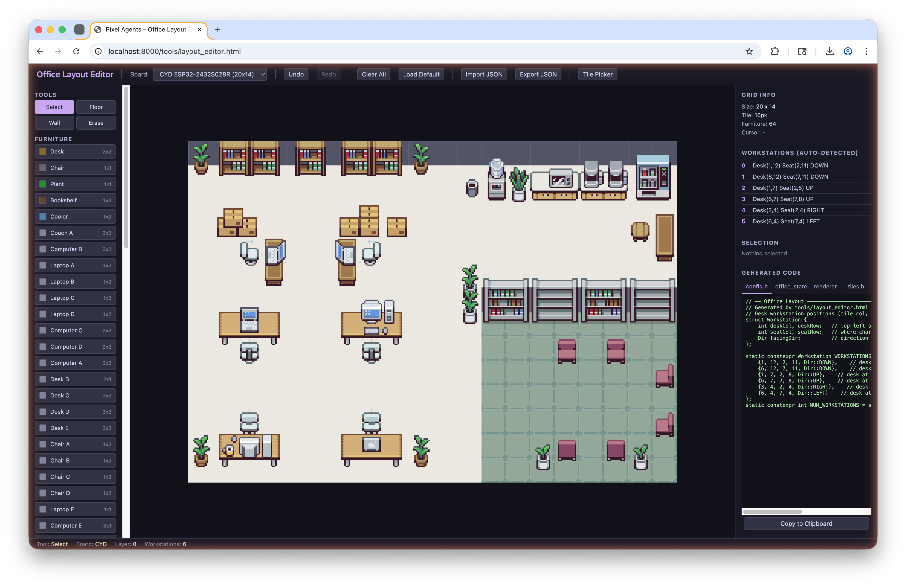
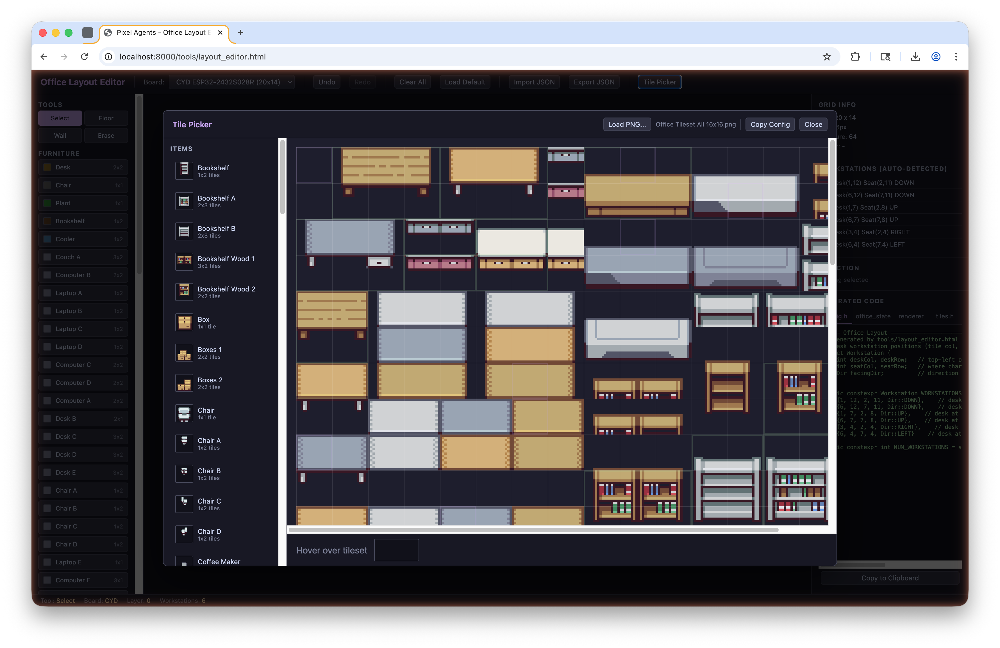

# Pixel Agents ESP32

A standalone hardware display that renders Claude Code agents as animated pixel art characters in a virtual office scene. Runs on an ESP32 with a small color TFT display.

<p>
  
  &nbsp;&nbsp;
  
</p>

Based on the [pixel-agents](https://github.com/pablodelucca/pixel-agents) VS Code extension by [@pablodelucca](https://github.com/pablodelucca).

## Table of Contents

- [How It Works](#how-it-works)
- [Hardware](#hardware)
- [Setup](#setup)
- [What You'll See](#what-youll-see)
- [macOS Companion App](#macos-companion-app)
- [Agent Characters](#agent-characters)
- [Office Dog](#office-dog)
- [Layout Editor](#layout-editor)
- [Serial Protocol](#serial-protocol)
- [Project Structure](#project-structure)
- [Third-Party Assets](#third-party-assets)
- [License](#license)

## How It Works

```
Claude Code CLI  -->  JSONL transcripts  -->  macOS app / Python bridge  -->  USB Serial / BLE  -->  ESP32 + TFT
```

1. **Claude Code** writes JSONL transcript files as you work
2. **Companion app** (native macOS menu bar app or cross-platform Python bridge) watches those files, detects agent state changes, and fetches usage stats from the Anthropic API
3. **ESP32 firmware** receives state updates over USB serial or BLE and animates the office scene

Characters walk to their desks when active, sit and type/read while tools run, wander around the office when idle, and spawn/despawn with a matrix effect.

## Hardware

Either board works out of the box — just pick the right PlatformIO environment.

**Option A (recommended):** ESP32-2432S028R "Cheap Yellow Display" (CYD) (~$12)
- ESP32-WROOM, built-in 2.8" ILI9341 (240x320), resistive touch, micro USB
- 320x240 landscape → 20x14 tile grid (more room for wandering)
- Touch input for cycling status modes, hamburger menu for dog settings
- Build env: `cyd-2432s028r`

**Option B:** [LILYGO T-Display S3](https://www.lilygo.cc/products/t-display-s3) (~$15)
- ESP32-S3, built-in 1.9" IPS display (170x320, ST7789), USB-C
- 320x170 landscape → 20x10 tile grid
- Build env: `lilygo-t-display-s3`

## Setup

### Prerequisites

- [PlatformIO](https://platformio.org/) (CLI or VS Code extension)
- One of the supported boards (see Hardware above)
- **macOS companion**: macOS 13+, Xcode CLI tools, [XcodeGen](https://github.com/yonaskolb/XcodeGen) (`brew install xcodegen`)
- **Python companion**: Python 3.8+ with pip (cross-platform)

### 1. Generate Sprite Headers

```bash
python3 tools/sprite_converter.py
```

This creates C header files in `firmware/src/sprites/` from the built-in sprite definitions. Open `tools/sprite_validation.html` in a browser to visually verify the sprites.

### 2. Customize the Office Layout (Optional)

Use the [Layout Editor](#layout-editor) to design a custom office floor plan, place furniture, and export firmware-ready code. See the full section below for details.

**Quick start:**

```bash
# Serve via HTTP (required — file:// causes canvas security errors)
python3 -m http.server 8000
```

Then open `http://localhost:8000/tools/layout_editor.html` in your browser.

### 3. Build & Flash Firmware

```bash
cd firmware

# For CYD (ESP32-2432S028R):
pio run -e cyd-2432s028r --target upload

# For LILYGO T-Display S3:
pio run -e lilygo-t-display-s3 --target upload
```

PlatformIO will download the ESP32 toolchain and TFT_eSPI library automatically on first build.

### 4. Start the Companion Bridge

**Option A: macOS app** (recommended for macOS users)

See the [macOS Companion App](#macos-companion-app) section for full details.

```bash
cd macos/PixelAgents && xcodegen generate && xcodebuild build -scheme PixelAgents -configuration Debug
open ~/Library/Developer/Xcode/DerivedData/PixelAgents-*/Build/Products/Debug/PixelAgents.app
```

**Option B: Python bridge** (cross-platform)

```bash
python3 run_companion.py
```

The launcher auto-creates a virtual environment, installs dependencies, and runs the bridge. Subsequent runs skip setup and launch instantly.

The bridge auto-detects the ESP32 serial port. To specify manually:

```bash
python3 run_companion.py --port /dev/cu.usbmodemXXXX
python3 run_companion.py --transport ble --ble-pin 1234
```

### 5. Use Claude Code

Start using Claude Code as normal. The display will show your agents in the office scene.

## What You'll See

- **Agent spawns** with a matrix-style column reveal effect
- **Active agent** walks to its desk and sits down to type or read
- **Idle agent** stands up and wanders around the office
- **Speech bubbles** show permission and waiting indicators; tool names appear in the status bar
- **Status bar** at bottom cycles through 5 modes: connection overview, usage stats, agent list, FPS, and uptime
- **Usage stats** show current and weekly Claude Code rate-limit usage as percentage bars
- **Multiple agents** each get their own desk

## macOS Companion App

<p>
  
</p>

The native macOS menu bar app is the recommended way to connect the ESP32 on macOS. It replaces the Python bridge with a standalone `.app` — no Python, pip, or terminal required after the initial build.

### Features

- **Menu bar presence** — runs as a menu bar icon with a popover UI, no Dock icon
- **Serial and BLE transports** — switch between USB serial and Bluetooth Low Energy from the popover
- **Auto-detection** — serial ports detected automatically via IOKit; BLE devices discovered via CoreBluetooth scan with PIN display
- **Usage stats** — reads your Claude Code OAuth token from macOS Keychain to fetch usage stats directly from the Anthropic API
- **Live agent list** — shows active agents with their current state (typing, reading, idle) in the popover
- **Screenshot capture** — grab a screenshot from the ESP32 display over serial (saved to `~/Pictures/PixelAgents/`)
- **Auto-reconnect** — reconnects automatically after USB unplug/replug or BLE disconnect
- **Sleep/wake aware** — pauses timers on sleep, reconnects on wake
- **Launch at login** — optional toggle via the popover menu

### Requirements

- macOS 13 (Ventura) or later
- Xcode Command Line Tools (for building)
- [XcodeGen](https://github.com/yonaskolb/XcodeGen) (`brew install xcodegen`)

### Build & Run

```bash
cd macos/PixelAgents
xcodegen generate
xcodebuild build -scheme PixelAgents -configuration Debug

# Launch the app
open ~/Library/Developer/Xcode/DerivedData/PixelAgents-*/Build/Products/Debug/PixelAgents.app
```

### Connecting

1. Click the menu bar icon to open the popover
2. Select **Serial** or **BLE** transport
3. **Serial**: the app auto-detects USB serial ports. Select a port or leave on "Auto"
4. **BLE**: the app scans for nearby PixelAgents devices and displays their 4-digit PINs. Click **Connect** next to the device you want

> **Keychain access:** On first launch, macOS may prompt you to allow PixelAgents to access "Claude Code-credentials" from your Keychain. This is needed to fetch usage stats from the Anthropic API. If you deny, everything else works normally — usage stats just won't be available.

### Architecture

```
PixelAgents.app (SwiftUI MenuBarExtra)
├── Model        — AgentTracker, StateDeriver, ProtocolBuilder, TranscriptWatcher, UsageStats
├── Transport    — SerialTransport (IOKit/POSIX), BLETransport (CoreBluetooth NUS)
├── Services     — BridgeService (orchestrator), ScreenshotService, UsageStatsFetcher
└── Views        — MenuBarView, ConnectionStatusView, AgentListView, UsageStatsView, TransportPicker
```

The app polls JSONL transcripts at 4 Hz (matching the Python bridge), sends heartbeats every 2s, and checks usage stats every 10s. All business logic is a direct port of the Python companion.

### Tests

```bash
cd macos/PixelAgents
xcodebuild test -scheme PixelAgents -configuration Debug
```

23 unit tests covering ProtocolBuilder, StateDeriver, and AgentTracker.

## Agent Characters

All 6 characters are always visible on screen. At boot they spawn in two social zones — 3 in the break room and 3 in the library — and wander within their zone until assigned work.

### Lifecycle

```
Boot → appear (matrix reveal) → IDLE (wander in social zone)
                                   ↓ agent activates
                                WALK → desk → TYPE / READ
                                   ↑ agent goes idle
                                WALK → back to social zone → IDLE
```

All 6 characters appear once at boot with a matrix-style column reveal effect and remain on screen permanently. They never despawn — when an agent goes inactive, the character walks back to its social zone rather than disappearing.

When the companion bridge reports an agent becoming active, the nearest unassigned character claims a desk and pathfinds to it. Once seated, the character animates typing or reading depending on the tool in use:

- **TYPE** — tools that write (`Edit`, `Write`, `Bash`, etc.)
- **READ** — tools that read (`Read`, `Grep`, `Glob`, `WebFetch`, `WebSearch`)

### State Machine

| State | Animation | Behavior |
|-------|-----------|----------|
| IDLE | Standing frame | Wanders within assigned social zone (2–20s pause, 3–6 moves per burst) |
| WALK | 4-frame cycle (0.15s/frame) | BFS pathfinding at 48 px/s to destination tile |
| TYPE | 2-frame cycle (0.3s/frame) | Seated at desk, typing animation |
| READ | 2-frame cycle (0.3s/frame) | Seated at desk, reading animation |

Characters face 4 directions (DOWN, UP, RIGHT, LEFT). LEFT sprites are rendered by flipping RIGHT horizontally. Each character has a unique color palette (hair, skin, shirt, pants, shoes).

### Rendering

The scene renders at 15 FPS using a double-buffered sprite. Entities (characters, furniture, dog) are depth-sorted by Y position so closer objects draw in front. Characters seated at desks are offset to visually align with the chair sprite.

## Office Dog

A dog roams the office autonomously, cycling through three behaviors:

```
WANDER (20 min) → FOLLOW (20 min) → WANDER → FOLLOW → ...
                         ↑
                 NAP interrupts every 4 hours (lasts 30 min)
```

**WANDER** — The dog picks random tiles and walks to them, pausing 2–6 seconds between moves. Each pause has an 8% chance of triggering a pee animation (3s) and each walk has a 15% chance of becoming a run (faster speed, different sprite cycle).

**FOLLOW** — The dog picks a random character and stays within 5 tiles of them, re-pathfinding every 8 seconds. If the target sits down at a desk (typing or reading), the dog sits beside them. A new follow target is picked every hour.

**NAP** — A global timer counts down regardless of current behavior. Every 4 hours the dog stops everything, lays down, and naps for 30 minutes before returning to WANDER.

### Animations

| Animation | Frames | When |
|-----------|--------|------|
| Idle | 8 frames (0.3s each) | Standing still — default when not walking, sitting, peeing, or napping |
| Walk | 4 frames (0.12s each) | Moving to a tile at 40 px/s |
| Run | 8 frames (0.08s each) | 15% chance a wander walk becomes a run at 72 px/s |
| Sit | 1 frame | Following a character who is seated at a desk |
| Pee | 1 frame | 8% chance during wander pauses, lasts 3 seconds |
| Lay down | 1 frame | Napping (30 minutes every 4 hours) |

The dog sprite is side-view only — LEFT facing is rendered by flipping the RIGHT sprite horizontally. The dog uses BFS pathfinding and depth-sorts with characters.

On the CYD board, the dog can be toggled on/off and its color changed (black, brown, gray, tan) via the hamburger menu. Settings persist across reboots via NVS.

## Layout Editor

<p>
  
  &nbsp;&nbsp;
  
</p>

The layout editor (`tools/layout_editor.html`) is a browser-based visual tool for designing the office scene. It must be served over HTTP — opening the file directly (`file://`) will cause canvas security errors when exporting tile sprites.

```bash
python3 -m http.server 8000
# Open http://localhost:8000/tools/layout_editor.html
```

### Board Selection

A dropdown at the top switches between the two supported boards. Each has a different grid size:

- **LILYGO T-Display S3** — 20x10 tile grid (320x170 px)
- **CYD ESP32-2432S028R** — 20x14 tile grid (320x240 px)

Switching boards resizes the canvas and adjusts the default layout accordingly.

### Drawing Tools

The left toolbar provides four tools for painting the tile grid:

| Tool | Behavior |
|------|----------|
| **Select** | Click a placed furniture item to select it. Press Delete to remove. |
| **Floor** | Paint floor tiles. Click or drag to fill multiple tiles. |
| **Wall** | Paint wall tiles. Click or drag to fill a row. |
| **Erase** | Remove tiles or furniture. Right-click also erases in any mode. |

Below the tools is a **Furniture** palette listing all available furniture items (desks, chairs, shelves, plants, etc.) with size indicators. Click one, then click on the grid to place it.

### Layers

Furniture items can be placed on different layers (adjustable via +/− controls), allowing overlapping items to render in the correct order. This is useful for placing decorations on top of desks or stacking wall-mounted items.

### Workstation Auto-Detection

The editor automatically detects workstations by finding desk + chair pairs that are adjacent to each other. The right panel lists all detected workstations with their grid positions. Up to 6 workstations are supported (one per agent character).

### Character Preview

The **Toggle Characters** button overlays idle agent sprites at each detected workstation, so you can verify desk placement and spacing before exporting.

### Tile Picker

The **Tile Picker** button opens a modal for managing tile graphics:

- **Load PNG** — Import a tileset spritesheet (e.g., the 16x16 Office Tileset). The picker displays the full sheet and lets you click to select tile regions.
- **Item library** — A sidebar lists all defined tile items (floors, walls, furniture pieces). Click an item to view or re-select its source region from the tileset.
- **Create new items** — Define new furniture, floor, or wall tiles by specifying a name, type, dimensions (in tiles), and optional role (desk, chair, or none). Then click on the tileset to pick the graphic.
- **Delete items** — Hover over an item in the sidebar and click the × to remove it.
- **Copy Config** — Exports the current tile library as a reusable JSON config.

### Import / Export

- **Export JSON** — Saves the entire layout (tile grid, furniture placements, layers, workstations) as a JSON file for later editing.
- **Import JSON** — Loads a previously exported layout.
- **Load Default** — Resets to the built-in default layout for the selected board.
- **Clear All** — Removes everything from the grid.

Full undo/redo support (Ctrl+Z / Ctrl+Y) is available for all editing operations.

### Code Generation

The right panel has four export tabs, each generating copy-pasteable C/C++ code for a different firmware file:

| Tab | Target File | What It Generates |
|-----|-------------|-------------------|
| **config.h** | `firmware/src/config.h` | Workstation position arrays (`WORKSTATION_DESK_TILES`, `WORKSTATION_CHAIR_TILES`, etc.) |
| **office_state** | `firmware/src/office_state.cpp` | `initTileMap()` floor/wall grid and `TileType::BLOCKED` entries for furniture |
| **renderer** | `firmware/src/renderer.cpp` | `drawFurniture()` function with all sprite draw calls, depth-sorted |
| **tiles.h** | `firmware/src/sprites/tiles.h` | RGB565 `PROGMEM` sprite arrays for every tile graphic used in the layout |

Copy each tab's output into the corresponding firmware file, then build and flash.

## Serial Protocol

Binary framing: `[0xAA][0x55][MSG_TYPE][PAYLOAD...][XOR_CHECKSUM]`

| Message | Code | Payload |
|---------|------|---------|
| Agent Update | 0x01 | agent_id + state + tool_name_len + tool_name |
| Agent Count | 0x02 | count |
| Heartbeat | 0x03 | timestamp (4 bytes, big-endian) |
| Status Text | 0x04 | agent_id + text_len + text |
| Usage Stats | 0x05 | current_pct + weekly_pct + current_reset_min (2 bytes) + weekly_reset_min (2 bytes) |
| Screenshot Req | 0x06 | (none) |

## Project Structure

```
pixel-agents-esp32/
  run_companion.py         # Companion launcher (auto-creates venv, installs deps)
  assets/                  # External art assets (gitignored)
    Office Tileset/        # 16x16 tileset used by sprite_converter
  firmware/                # ESP32 PlatformIO project
    platformio.ini
    src/
      main.cpp             # Entry point
      config.h             # Constants, enums, layout
      protocol.h/.cpp      # Serial protocol parser
      office_state.h/.cpp  # Character FSM, pathfinding
      renderer.h/.cpp      # Display rendering
      splash.h/.cpp        # Animated boot splash screen
      transport.h/.cpp     # Transport abstraction (Serial, BLE)
      ble_service.h/.cpp   # NimBLE BLE NUS server (CYD only)
      thermal_mgr.h/.cpp   # Junction temperature monitoring
      touch_input.h/.cpp   # XPT2046 touch driver (CYD only)
      led_ambient.h/.cpp   # RGB LED breathing effects (CYD only)
      sprites/             # Generated PROGMEM sprite data
        characters.h
        furniture.h
        tiles.h            # Floor/wall/furniture from layout editor
        bubbles.h
        dog.h              # Master dog sprite include
        dog_black/brown/gray/tan.h  # Dog color variants
  companion/               # Python bridge service
    pixel_agents_bridge.py
    ble_transport.py       # BLE client transport (bleak)
    requirements.txt
  macos/PixelAgents/       # Native macOS companion app (Swift/SwiftUI)
    project.yml            # XcodeGen project spec
    PixelAgents/
      PixelAgentsApp.swift # Menu bar app entry point
      Model/               # AgentTracker, StateDeriver, ProtocolBuilder, etc.
      Transport/           # SerialTransport (IOKit/POSIX), BLETransport (CoreBluetooth)
      Services/            # BridgeService orchestrator, ScreenshotService
      Views/               # SwiftUI menu bar popover UI
    PixelAgentsTests/      # Unit tests (23 tests)
  tools/                   # Build tools
    sprite_converter.py      # Character/furniture sprite → C header
    convert_characters.py    # Character sprite sheet converter
    convert_dog.py           # Dog sprite sheet → C header
    sprite_validation.html   # Generated visual check
    layout_editor.html       # Office layout editor (serve via HTTP)
    firmware_update.html     # Browser-based firmware flasher (Web Serial)
```

## Third-Party Assets

### Office Tileset

The office tileset used in this project and available via the extension is [Office Interior Tileset (16x16)](https://donarg.itch.io/office-interior-tileset-16x16) by Donarg, available on itch.io for $2 USD.

This is the only part of the project that is not freely available. The tileset is not included in this repository due to its license. To use Pixel Agents locally with the full set of office furniture and decorations, purchase the tileset, unzip the file and move the "Office Tileset" directory from the expanded zip into the `assets/` directory. Otherwise it will fallback to a default tileset.

### Dog Sprites

The dog pet sprites are based on [Dog Animation - 4 Different Dogs](https://nvph-studio.itch.io/dog-animation-4-different-dogs) by [NVPH Studio](https://nvph-studio.itch.io/), licensed under [CC BY-ND 4.0](https://creativecommons.org/licenses/by-nd/4.0/). The sprites were resized to 25x19 pixels for use in the pixel art scene. No other modifications were made to the original artwork.

## License

[PolyForm Noncommercial License 1.0.0](LICENSE)
